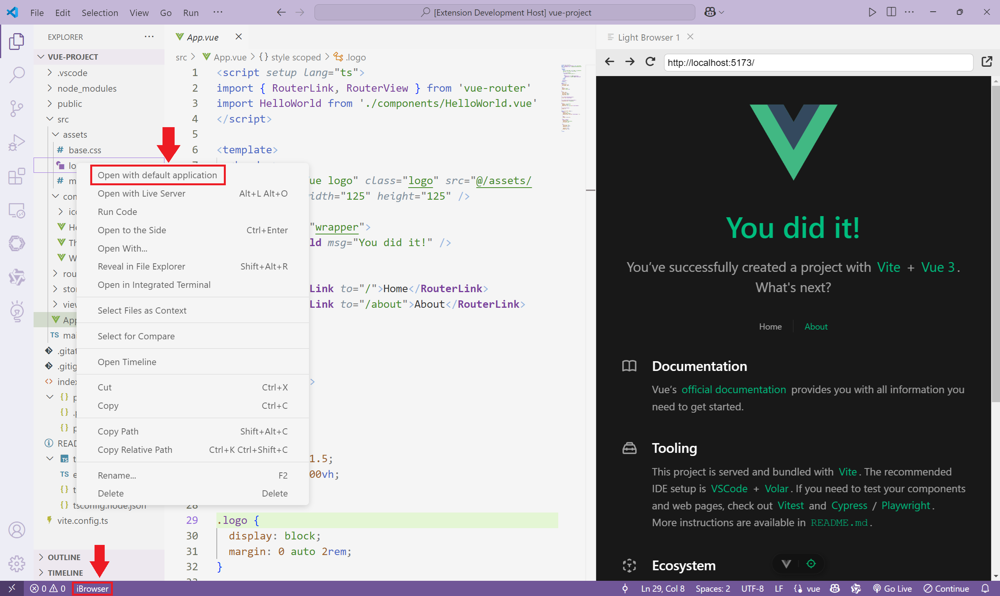

    
    <h1 align="center">light-browser</h1>
    
A simple plugin for opening files with the default application and browsing web pages via iframe within the IDE.

    

## Features

- Open current file with default application
- Open a web page with `iframe`

## Usage

### Opening files with the default application

In the editor or explorer area, right-click, and choose `Open with default application` to open the file with default application outside the IDE.

### Open a web page with `iframe`

> **Attention:** Web pages loaded using `iframe` in IDE have significant restrictions.
>
> - Cannot load local files
> - Cannot redirect web pages
> - Some web pages cannot be opened
> - Page scaling may not be appropriate
> 
> Therefore, it can only be used for simple web browsing and is not suitable for interacting with web pages.

Click on the `iBrowser` status bar item to open an `iframe` browser window within the IDE.4

## Settings

You can choose to show or hide the `iBrowser` status bar item.

